[](#)
[](#)
[](#)
[](LICENSE)
[](README.md)
[](README_fr.md)

---

## 📑 Table of Contents
- [Preview](#-preview)
- [Technical specifics](#-technical-specifics-mlx-x11-and-low-level-graphics)
- [Concepts & skills](#-concepts--skills-demonstrated)
- [Features](#-features-and-interactions)
- [Installation](#%EF%B8%8F-installation)
- [Launch examples](#-launch-examples)
- [Gallery](#-gallery)
- [Future improvements](#-future-improvements)
- [License](#-license)

---

# 🦠 Fractol — Interactive fractal visualization in C with MiniLibX

<p align="center">
  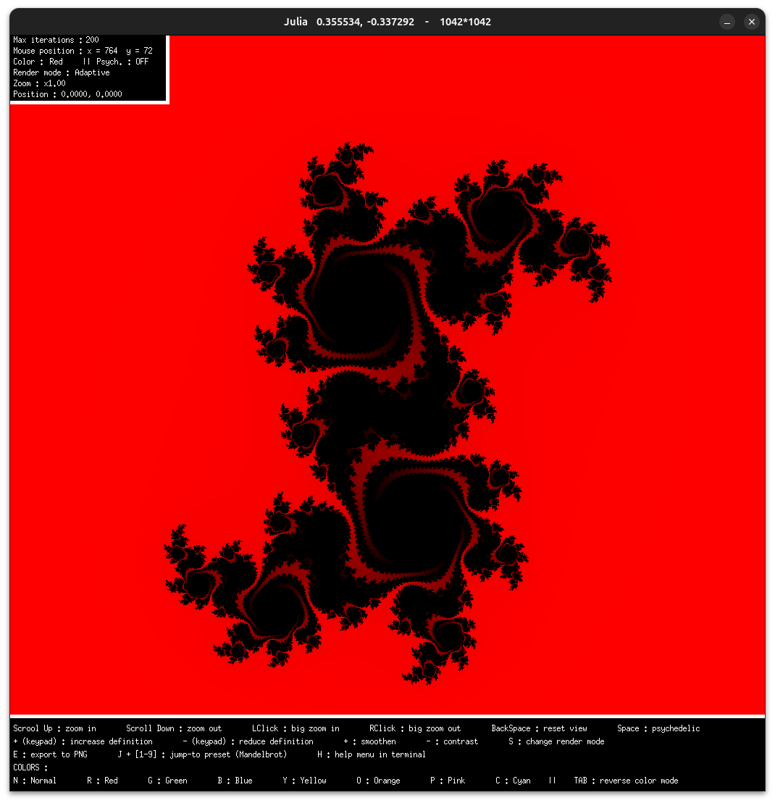
</p>

Real-time, interactive visualization of mathematical fractals (**Mandelbrot**, **Julia**, **Sierpiński Carpet**) in C.  
Native graphic rendering through **MiniLibX (MLX)**.  
Two internal architectures: sequential version and optimized multi-threaded version (user can disable multi-threading at launch).

---

## 🖥️ Technical specifics: MLX, X11, and low-level graphics

**Fractol** is built exclusively on **MiniLibX (MLX)**:  
- Direct manipulation of the framebuffer.
- Manual control over the window, keyboard and mouse events, and refresh cycles.
- No graphics engine or framework in between: explicit handling of pixels, buffers, and render loops.
- Portable on Unix systems (Linux, macOS depending on the MLX version).

💡 **Technical note:**  
On Linux, MLX relies on **X11** (*X Window System*), the historical graphics API for Unix systems.  
This implies:
- Implicit understanding of how events and window refresh are handled in a **very low-level** environment.
- Exposure to concepts used by countless graphic tools, desktop environments, and professional applications for decades.
- Broad, proven compatibility: any program using X11 can run on virtually any Linux distribution (standard graphics server).
- A simple, minimalistic architecture — ideal for learning the basics of 2D rendering without unnecessary overhead.

In short, even though you code with MLX, you are **indirectly working with the fundamentals of X11**, which provides deeper insight into the low-level software layers that power most Unix/Linux graphical applications.

---

## 🚀 Concepts & skills demonstrated

- **Applied mathematics:** manipulation of fractal sets, complex arithmetic, precise iterative computation.
- **Low-level C programming:** memory management, modular structuring, fine control over buffers and concurrent access.
- **Native graphics rendering:** direct pixel write/read in the MLX buffer, full control over per-pixel rendering.
- **Interactive design:** advanced handling of inputs (keyboard, mouse), responsive interface, real-time adjustments.
- **Parallelization:** manual use of POSIX threads to speed up rendering on multi-core CPUs.
- **Optimization:** strict separation between computation logic, rendering, thread management, and input handling.
- **Robustness:** error handling, memory stability, edge case management, and race condition prevention.

---

## 🎨 Features and interactions

- **Fractal selection** at launch:  
    - `mandelbrot`, `julia`, `sierpinski` (Sierpiński carpet).
    - **Launch parameters**:
        - `-f`: Enable *fullscreen* mode.  
          ⚠️ On multi-screen setups, the total resolution across all screens will be used (MLX limitation).  
          Without this flag, the window size is hardcoded in the program.
        - Multi-threading is enabled by default. To disable: `-mt=no`.
        - `-h` or `--help`: Show full documentation in the terminal.

- **Full real-time rendering control:**
    - Smooth or fast zoom (mouse wheel, click).
    - Zoom centered on the cursor.
    - Move using click/wheel or arrow keys.
    - Dynamically adjust the number of iterations.
    - Dynamic contrast and smoothing control.

- **Color rendering modes:**  
	Several rendering methods are available, changing the fractal's visual appearance.  
	They can be switched at any time using the dedicated keyboard shortcut (`S`).

	- **Logarithmic**:  
	  Enhances color variations near the set's boundary by applying a logarithmic scale to the iteration count.
	- **Adaptive**:  
	  Dynamically adjusts the color scale based on the actual iteration range present on screen, optimizing global contrast.
	- **Fixed Log**:  
	  Logarithmic variant using a fixed base, producing a more uniform look regardless of zoom depth.
	- **Cyclic Modulo**:  
	  Applies a repeating color cycle based on modulo arithmetic, creating strong, periodic visual patterns.
	- **Exponential**:  
	  Amplifies color differences using exponential progression, generating vivid, high-contrast gradients.

- **Interactive palette and display:**
    - Change color schemes (R/G/B/Y/...).
    - Instant color inversion.
    - Activate psychedelic mode.

- **Live information display (HUD):**
    - Max iterations.
    - Mouse coordinates.
    - Active color mode.
    - Active rendering mode.
    - Current zoom level.
    - Current position in the complex plane.

- **Navigation and shortcuts:**
    - `J` + `[1-9]`: Direct access to famous Mandelbrot locations  
      (*e.g.: Elephant Valley, Seahorse Valley…*).
    - **Julia presets**: quick launch with predefined aliases.  
      Example: `./fractol julia dendrite`, `./fractol julia 1`, `./fractol julia d`.

- **Image export:**
    - `E`: Export the current fractal as a **fullscreen PNG**,  
      even if running in windowed mode.
    - The filename automatically includes the current parameters  
      (fractal type, coordinates, zoom, color mode…).

---

## ⚙️ Installation

Clone and compile:
```bash
git clone https://github.com/<your_user>/fractol.git
cd fractol
make
```

Run:
```bash
./fractol mandelbrot
```

---

## 🛠️ Launch examples

```bash
# Mandelbrot
./fractol mandelbrot

# Mandelbrot fullscreen
./fractol mandelbrot -f

# Mandelbrot without multi-threading
./fractol mandelbrot -mt=no

# Julia standard
./fractol julia

# Julia with "dendrite" preset
./fractol julia dendrite

# Sierpiński carpet (single-thread only)
./fractol sierpinski

# Help / manual
./fractol --help
```

---

## 📋 Requirements

- C99+
- MiniLibX (MLX)
- POSIX Threads (for the multi-thread option)
- Linux or macOS (depending on the MLX version)

---

## 🎯 Achievements

- Interactive fractal rendering engine, fast (given MLX constraints), optimized and flexible.
- Mastery of MLX and low-level graphics rendering.
- Robust implementation of complex arithmetic.
- Practical optimization through multi-threading (manual thread pool).
- Real-time controlled interface with multiple options.
- Extended interactive features:
  PNG export, navigation to predefined points of interest, Julia presets,
  and real-time display of rendering parameters.
- Modular C code architecture focused on maintainability and performance.

---

No dependencies on any frameworks other than MiniLibX.  
Project focused on algorithmics, mastery of low-level programming, and optimization of real-time mathematical rendering.

----

## 🖼 Gallery

> Click to expand each section. Media are stored in `assets/`.

<details>
  <summary><b>Mandelbrot — zooms & famous regions</b></summary>

<table>
<tr>
<td align="center" width="50%">
  <br>
  <em>Mandelbrot Overview</em>
</td>
<td align="center" width="50%">
  <br>
  <em>Elephant Valley</em>
</td>
</tr>
<tr>
<td align="center" width="50%">
  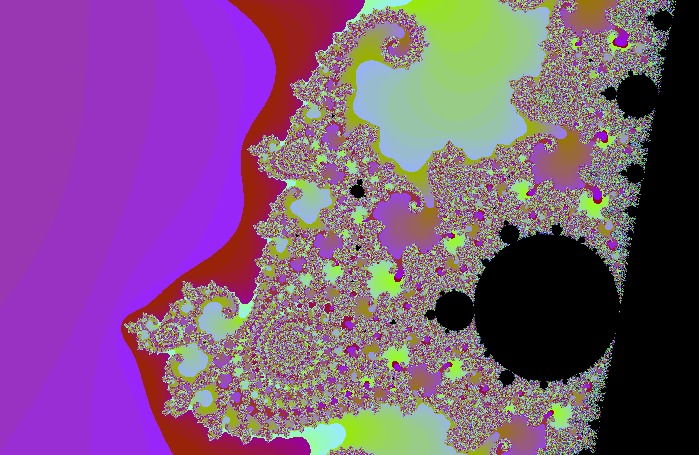<br>
  <em>Seahorse Valley</em>
</td>
<td align="center" width="50%">
  <br>
  <em>Deep Zoom</em>
</td>
</tr>
</table>

<p><i>Tip:</i> Use <code>J</code> + <code>[1-9]</code> to jump to certain zones in one click.</p>
</details>

<details>
  <summary><b>Julia — presets & aliases</b></summary>

<table>
<tr>
<td align="center" width="50%">
  <br>
  <em>Julia - Dendrite</em>
</td>
<td align="center" width="50%">
  <br>
  <em>Julia - Airplane</em>
</td>
</tr>
<tr>
<td align="center" width="50%">
  <br>
  <em>Julia - Tuning Fork</em>
</td>
<td align="center" width="50%">
  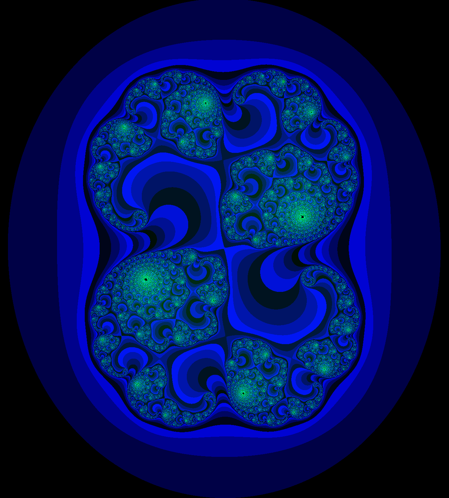<br>
  <em>Julia - Tuning Fork psychedelic</em>
</td>
</tr>
</table>

<p>Examples: <code>./fractol julia dendrite</code>, <code>./fractol julia 1</code>, <code>./fractol julia d</code></p>
</details>

<details>
  <summary><b>Rendering modes (Logarithmic / Adaptive / Fixed Log / Cyclic Modulo / Exponential)</b></summary>

<table>
<tr>
<td align="center" width="50%">
  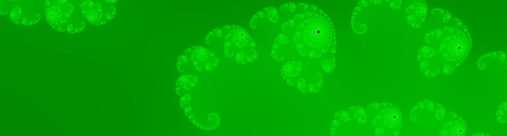<br>
  <em>Logarithmic</em>
</td>
<td align="center" width="50%">
  <br>
  <em>Adaptive</em>
</td>
</tr>
<tr>
<td align="center" width="50%">
  <br>
  <em>Fixed Log</em>
</td>
<td align="center" width="50%">
  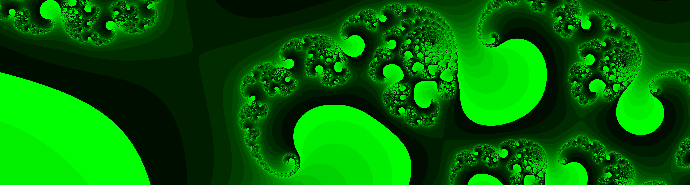<br>
  <em>Cyclic Modulo</em>
</td>
</tr>
<tr>
<td align="center" colspan="2">
  <br>
  <em>Exponential</em>
</td>
</tr>
</table>

<p>
  <small>
  Modes change the gradient's scale and progression based on the number of iterations.
  </small>
</p>
</details>

<details>
  <summary><b>HUD — live info & shortcuts</b></summary>

<table>
<tr>
<td align="center">
  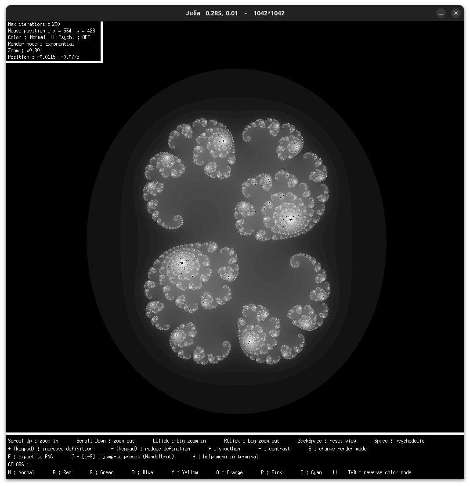<br>
  <em>HUD - Live info</em>
</td>
</tr>
</table>

<ul>
  <li>Max iterations</li>
  <li>Mouse coordinates</li>
  <li>Active color mode</li>
  <li>Active rendering mode</li>
  <li>Zoom level</li>
  <li>Position in the complex plane</li>
</ul>
</details>

<details>
  <summary><b>Sierpiński Carpet — depths</b></summary>

<table>
<tr>
<td align="center" width="50%">
  <br>
  <em>Depth 4</em>
</td>
<td align="center" width="50%">
  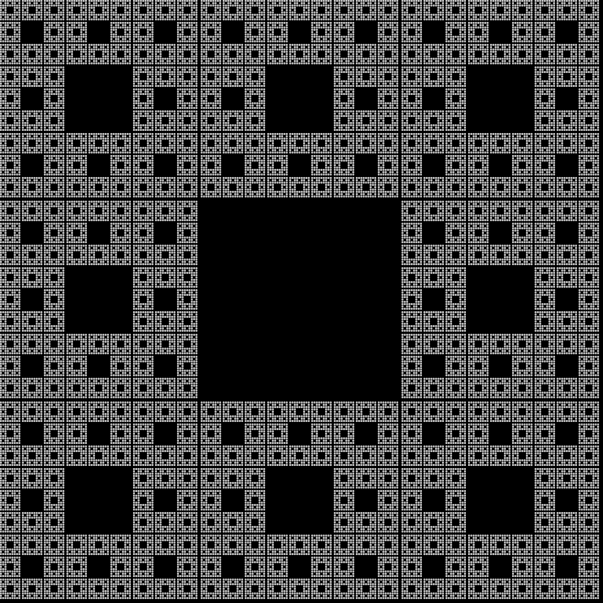<br>
  <em>Depth 6</em>
</td>
</tr>
</table>
</details>

<details>
  <summary><b>PNG Export (key <code>E</code>) — examples</b></summary>

<table>
<tr>
<td align="center" width="50%">
  <br>
  <em>Export 1</em>
</td>
<td align="center" width="50%">
  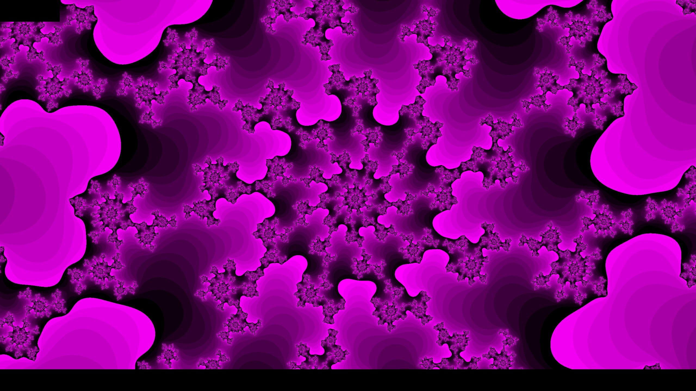<br>
  <em>Export 2</em>
</td>
</tr>
<tr>
<td align="center" width="50%">
  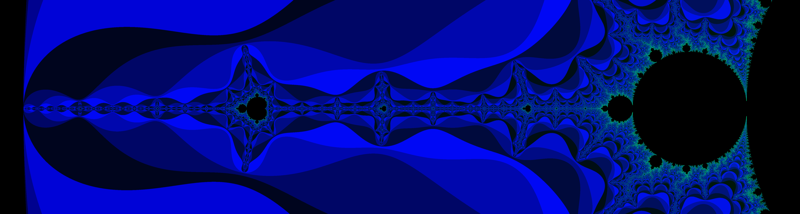<br>
  <em>Export 3</em>
</td>
<td align="center" width="50%">
  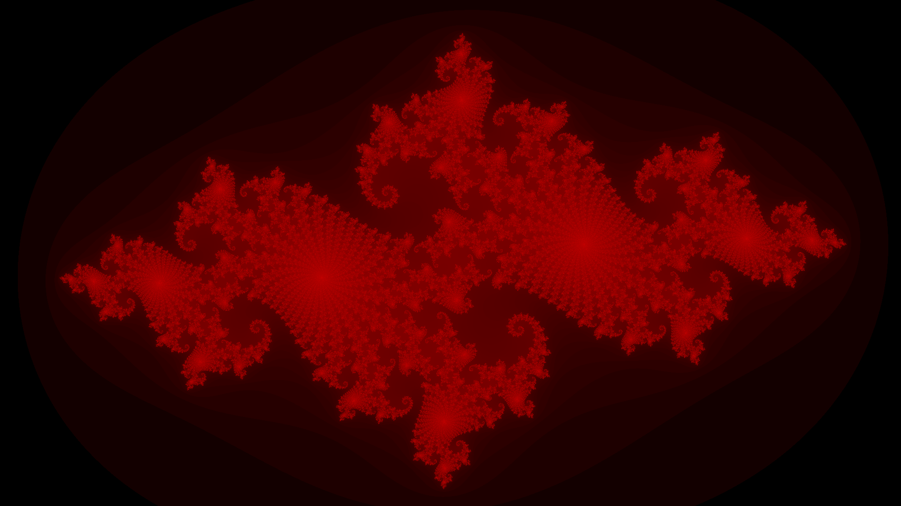<br>
  <em>Export 4</em>
</td>
</tr>
<tr>
<td align="center" width="50%">
  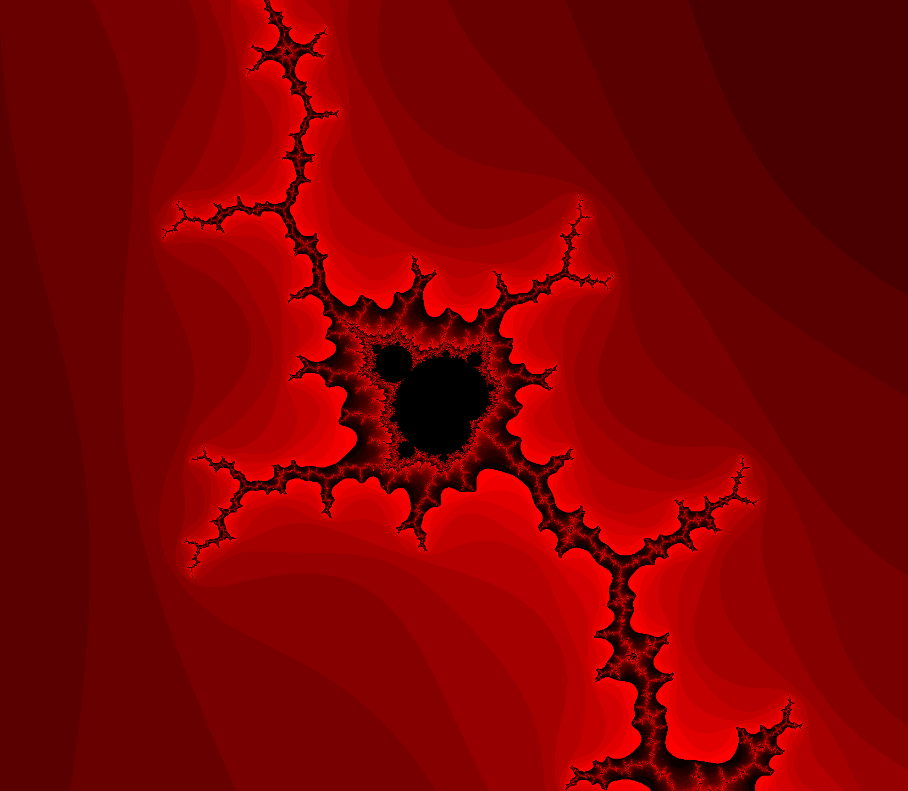<br>
  <em>Export 5</em>
</td>
<td align="center" width="50%">
  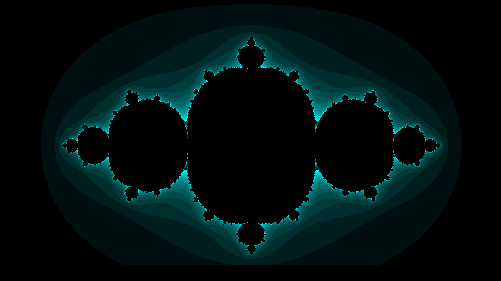<br>
  <em>Export 6</em>
</td>
</tr>
<tr>
<td align="center" width="50%">
  <br>
  <em>Export 7</em>
</td>
<td align="center" width="50%">
  <br>
  <em>Export 8</em>
</td>
</tr>
</table>

<p>
  Each export is <b>fullscreen</b> (even if the window is not), and the filename contains the parameters
  (fractal, coordinates, zoom, iterations, mode, etc.).
</p>
</details>

---

## 🔮 Future Improvements

- Support for additional fractals (Burning Ship, Newton…)
- Anti-aliasing for smoother edges
- Configuration file for startup parameters
- Enhanced color palette customization
- Multi-language in-app HUD
- Optional benchmark mode to measure render performance

---

## 📜 License

This project is licensed under the MIT License — see the [LICENSE](LICENSE) file for details.

